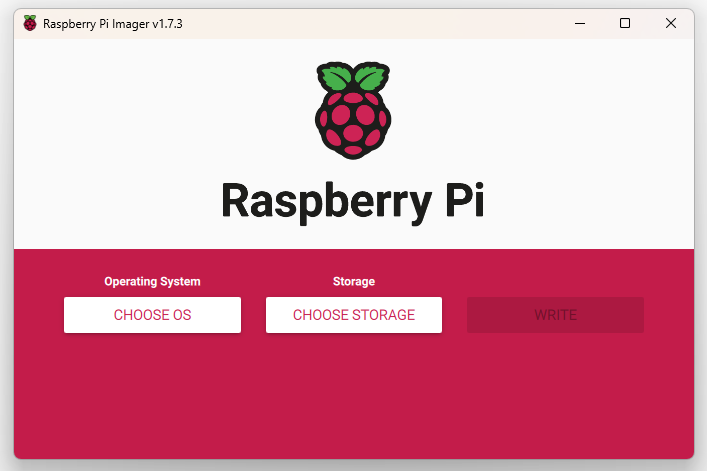
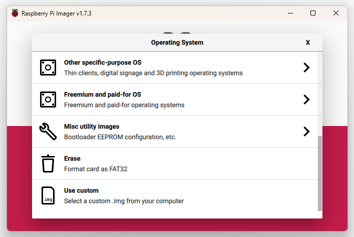
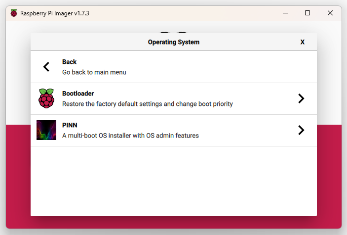
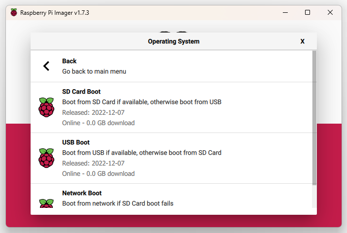

# PiNodeXMR - raspi4 personal private monero node

## Sources

>[PiNodeXMR Full manual](https://github.com/monero-ecosystem/PiNode-XMR/wiki/Manual#setup)
>
>[Video tutorial](https://youtu.be/riK8t_4llXw)

## Goal

Run private monero node over anonymity network (tor) for personal use.

## Hardware

Coul'd run on almost any HW, I have extra raspberry pi 2GB at home so the choice is clear.

- Computer, [Raspberry Pi 4 model B 2GB (more RAM recommended)](https://www.raspberrypi.com/products/raspberry-pi-4-model-b/)
- External box for disk, [EEM2-U3C USB-C 3.2 Gen 1 - SATA M.2 box](https://www.axagon.eu/en/produkty/eem2-u3c)
- SSD disk[^1], [WD Red™ SA500 NAS SATA SSD M.2 2280](https://www.westerndigital.com/products/internal-drives/wd-red-sata-m-2-ssd#WDS500G1R0B)
- Any SD card[^2]
- HDMI cable, micro HDMI -> HDMI (it is not absolutely necessary if you can handle headless setup)

[^1]: Use SSD drive, it's fast and reliable and and necessary to use as boot device
[^2]: Why any? since we want to boot from a USB SSD drive, we need SD card only to flash raspi4 EEPROM

## What steps are we going to take

1. Assembly and connect HW
2. Update bootloader to boot from USB
3. Boot from SSD.
4. Install and setup PiNode-XMR
5. Start node and let it sync

## 1. Assembly and connect

There's not much to write here ... assemble as best you can and according to the instructions of manufacturer,
use USB3 port (blue), use old good ethernet cable not WIFI. Do not insert SD card and do not power on yet.
To be sure connect raspi to external monitor.

## 2. Update bootloader to boot from USB

Why this? Because stock raspi will boot only from SD card and we want to boot from SSD drive and do not use SD card at all.
Why? Because SSD disk is better than SD card but let's make sure it's plugged to the blue USB3 port!

recommended boot from usb ssd instead of SDcard

First of all we need to make raspi to boot from USB because default is only from SDcard.
It's super easy, we need SDcard and [Raspberry Pi Imager](https://www.raspberrypi.com/software/)
> [Updating the Bootloader](https://www.raspberrypi.com/documentation/computers/raspberry-pi.html#updating-the-bootloader)

-> Insert SD Card to your computer and run [Raspberry Pi Imager](https://www.raspberrypi.com/software/)

-> Misc utility images -> Bootloader -> SD Card Boot[^3] -> choose storage and write

-> Boot the Raspberry Pi with the new image and wait for at least 10 seconds. The green activity LED will blink with a steady pattern and the HDMI display will be green on success.

-> Power off the Raspberry Pi and remove the SD card.

[^3]: Yes, SD Card Boot, Boot from SD Card if avaiable otherwise boot from USB

choose OS



Misc Utility Images



Bootloader



SD card Boot



choose SDcard and write image

## Ubuntu on ssd

download latest ubuntu server lts
<https://ubuntu.com/download/raspberry-pi>

connect ssd to computer

use Raspberry Pi Imager to write downloaded image to disk

after complited, plug usb drive to raspi, power on and let's boot to ubuntu server

raspi should be connected to LAN by ethernet cable

on computer connect via ssh to raspi ubuntu, ssh ubuntu@IP

you have to find out what IP address of your node is, it should be little bit tricky,

one way is to log in to your router and check there, another way is to use some of sw to get all IP addrs used on your LAN,

or probably easiest way is log in locally to node with monitor and keyboard connected and get ip addr there:

motd

IPv4 address for eth0:

or

```bash
ip a |grep eth0
```

inet 192.168.x.x

default user is ubuntu with password ubuntu, first login you need to change password and log in again

```bash
sudo apt update
sudo apt full-upgrade
wget -O - <https://raw.githubusercontent.com/monero-ecosystem/PiNode-XMR/master/Install-PiNode-XMR.sh> | bash
```

Follow the on screen instructions.

Stage 1 sets up the environment for user 'pinodexmr', security and network. Once this is completed a restart is required (automatic).

Stage 2 once rebooted. Log back in with user pinodexmr and password PiNodeXMR and the script will continue to install. No further interaction is required. However the process of compiling Monero from source is lengthy and resource intensive. For Pi 3b+ expect ~8hours for completion, for Pi 4 ~4hours.

after few hours your PiNode-XMR is ready, reboot

log in

change master password

install tor

start tor

go to web UI, config and start node (swap,bandwidth,tor private node)
