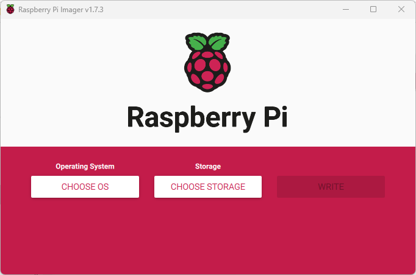

# pinodexmr

## personal xmr node on raspi4

HW:
raspi4 2GB (helium rak miner v2), more RAM recommended
axagon sata m.2 adapter
ssd m2 wd red 500GB

recommended boot from usb ssd instead of SDcard

First of all we need to make raspi to boot from USB because default is only from SDcard.
It's super easy, we need SDcard and [Raspberry Pi Imager](https://www.raspberrypi.com/software/)

choose OS

Misc Utility Images

Bootloader

SD card Boot

choose SDcard and write image

Raspberry Pi Imager provides a GUI for updating the bootloader and selecting the boot mode.

    Download Raspberry Pi Imager

    Select a spare SD card. The contents will get overwritten!

    Launch Raspberry Pi Imager

    Select Misc utility images under Operating System

    Select Bootloader

    Select a boot-mode i.e. SD (recommended), USB or Network.

    Select SD card and then Write

    Boot the Raspberry Pi with the new image and wait for at least 10 seconds.

    The green activity LED will blink with a steady pattern and the HDMI display will be green on success.

    Power off the Raspberry Pi and remove the SD card.

## Ubuntu on ssd

download latest ubuntu server lts
<https://ubuntu.com/download/raspberry-pi>

connect ssd to computer

use Raspberry Pi Imager to write downloaded image to disk

after complited, plug usb drive to raspi, power on and let's boot to ubuntu server

raspi should be connected to LAN by ethernet cable

on computer connect via ssh to raspi ubuntu, ssh ubuntu@IP

you have to find out what IP address of your node is, it should be little bit tricky,

one way is to log in to your router and check there, another way is to use some of sw to get all IP addrs used on your LAN,

or probably easiest way is log in locally to node with monitor and keyboard connected and get ip addr there:

motd

IPv4 address for eth0:

or

ip a |grep eth0

inet 192.168.x.x

default user is ubuntu with password ubuntu, first login you need to change password and log in again

sudo apt update

sudo apt full-upgrade

wget -O - <https://raw.githubusercontent.com/monero-ecosystem/PiNode-XMR/master/Install-PiNode-XMR.sh> | bash

Follow the on screen instructions.

Stage 1 sets up the environment for user 'pinodexmr', security and network. Once this is completed a restart is required (automatic).

Stage 2 once rebooted. Log back in with user pinodexmr and password PiNodeXMR and the script will continue to install. No further interaction is required. However the process of compiling Monero from source is lengthy and resource intensive. For Pi 3b+ expect ~8hours for completion, for Pi 4 ~4hours.

after few hours your PiNode-XMR is ready, reboot

log in

change master password

install tor

start tor

go to web UI, config and start node (swap,bandwidth,tor private node)
